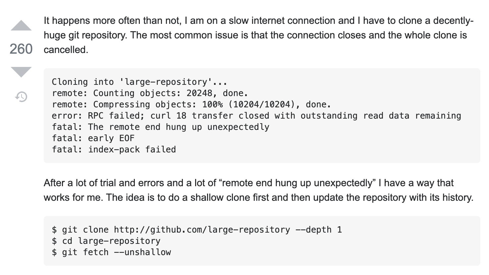

# Git

## Git 是个好东西~

* 问题：在弱网络情况下，有一个 repo 特别大， clone 的时候老失败怎么办？



解释一下：

depth 用来指定克隆的深度，这个深度指的是 commit 次数，这里 ```--depth 1``` 意思是只克隆最后一次 commit 的内容，这样需要克隆的项目就会小很多
```git fetch --unshallow``` 表示拉取完整项目
这样操作就可以保证在弱网络条件下拉取大型项目


